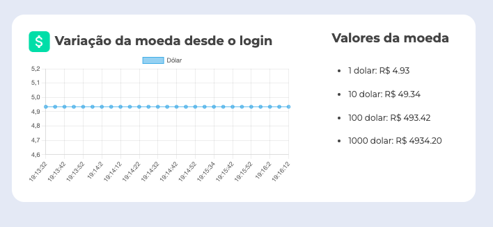

# Cotação em tempo real

 

## Assuntos abordados durante o curso
* Fetch API
* Threads
* Concorrência
* Paralelismo
* Event Loop
* Task Queue
* WebWorkers
* Single Thread
* MultiThread

## Tecnologias utilizadas no projeto
* HTML
* CSS
* JavaScript

<table>
  <tr>
    <td>
     
    </td>
    <td>
      Feito por Gleidson Queiroz.</a> 🙋🏼‍♂️
    </td>
  </tr>
</table>